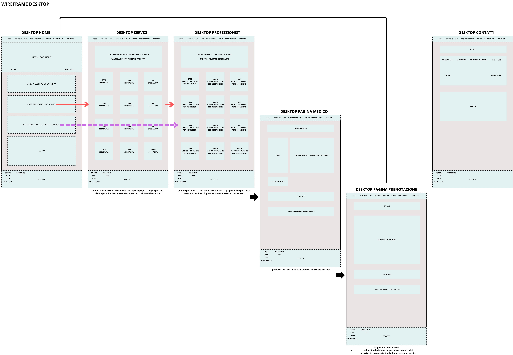

# Progetto Clinica Privata

Demo di sito web multipagina per un poliambulatorio privato, con sistema di prenotazione visite basato su `localStorage`.

Il progetto è stato realizzato come esercizio per la **Missione Lavorativa Openjob Front End — Ottobre 2025.

---

## Obiettivi principali

- Simulare un sito web moderno e responsive per una clinica privata
- Permettere all'utente di visualizzare i servizi, scegliere un medico e prenotare una visita
- Salvare e gestire le prenotazioni **senza database**, usando `localStorage`
- Mantenere un'esperienza utente fluida su **desktop e mobile**

---

## Struttura progettuale

Prima dello sviluppo, è stata realizzata una fase di analisi e progettazione dell’interfaccia attraverso **wireframe** desktop e mobile.

---

## Wireframe

### Desktop

### Mobile

